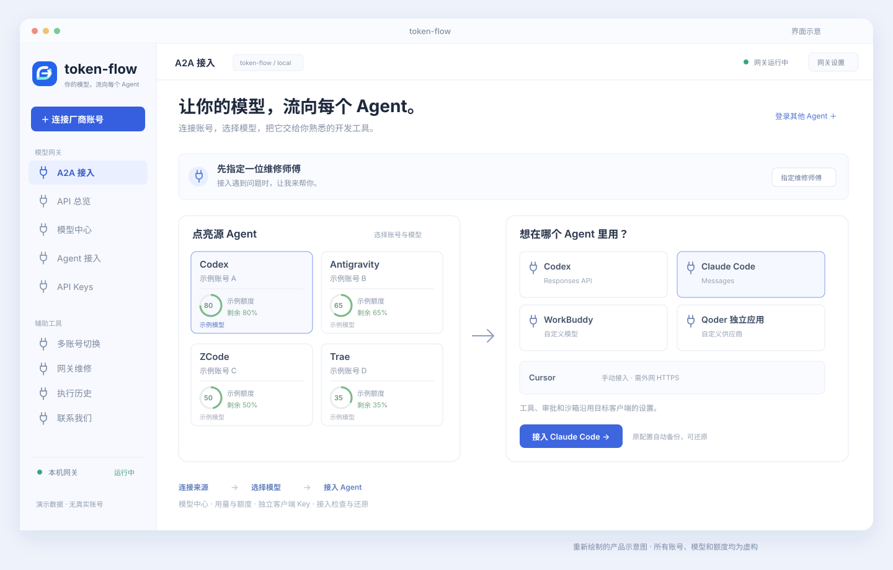
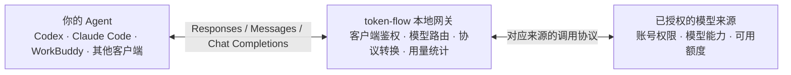

<div align="center">
  
  <h1>token-flow</h1>
  <p><strong>让你的模型，流向每个 Agent。</strong></p>
  <p>连接模型账号 · 选择模型 · 接入你习惯的开发工具</p>
</div>

token-flow 是一个本地运行的桌面模型网关。它将不同来源的账号授权、模型目录和调用协议集中到一个界面，让 Codex、Claude Code、WorkBuddy 等客户端通过统一入口使用你已授权的模型。

你继续在熟悉的 Agent 里工作，token-flow 负责模型连接、协议转换、客户端密钥和用量管理。

## 界面与桌面应用



*根据实际界面重新绘制的示意图。账号、模型和额度均为虚构示例，不包含真实账号、密钥或本机运行记录。*

桌面界面以 **A2A 接入** 为起点：左侧选择模型来源，右侧选择使用它的 Agent。模型中心集中管理账号与额度，API 总览展示网关运行情况，辅助工具提供账号切换和接入检查。

## 可以做什么

| 功能 | 用途 |
| --- | --- |
| 账号与模型管理 | 连接多个来源、查看模型目录和可查询的额度，分别启用或停用账号。 |
| A2A 接入 | 选择来源账号、模型和目标 Agent，备份原配置后写入接入设置，并支持还原。 |
| 统一模型接口 | 提供 Responses、Chat Completions 和 Anthropic Messages 接口，适配不同客户端。 |
| 独立客户端 Key | 为不同客户端分配密钥，限制可用来源、模型和累计 token 用量，随时撤销。 |
| 长会话支持 | 为适配的来源提供历史续接与上下文压缩，保留近期消息和未完成的工具调用。 |
| 网关维修 | 使用选定模型检查接入链路，展示具体修复方案，在审批后执行配置操作。 |
| 多账号切换 | 为支持的本地客户端切换登录账号，备份原登录状态并提供还原入口。 |

### 模型来源

项目包含 Codex、Claude、Antigravity、Kimi、xAI、Qoder、WorkBuddy、ZCode、Doubao 和 Trae 的登录或本地授权导入适配。各来源的连接方式以模型中心显示的入口为准。

Cursor 另有独立的 SDK 授权入口，能力与账号的 SDK 权限有关。将 Cursor 作为模型来源，与让 Cursor 客户端使用其他来源模型，是两个不同方向的接入。

**有适配入口不代表所有账号、模型和客户端组合都能使用。** 可用模型与额度取决于来源账号的权限、套餐和服务状态。登录成功、读取模型目录、查询额度、完成模型调用是不同的检查步骤；额度查询失败不会直接删除已有授权。

### 可以接入哪些 Agent

| 目标客户端 | 接入方式 |
| --- | --- |
| Codex | 在 A2A 页面选择模型，备份并更新模型接口配置。 |
| Claude Code | 通过 Messages 接口接入，保留客户端的工具与审批设置。 |
| WorkBuddy | 添加自定义模型，重启后在模型菜单中选择。 |
| Qoder 独立应用 | 添加自定义供应商与模型，需要客户端版本和账号支持自定义模型；Qoder IDE 与 CLI 的配置方式不同。 |
| Cursor | 提供手动配置入口，需要可从外网访问的 HTTPS 网关；本机 `localhost` 地址无法用于该接入方式。 |
| 其他兼容客户端 | 填写网关地址、客户端 Key 和模型 ID，使用所需协议。 |

Cursor 的手动入口不会自动把本机服务发布到公网。客户端配置完成后，仍需在目标 Agent 中选择模型并验证实际调用。

## 使用流程

1. **连接账号**：在模型中心完成来源授权，等待读取账号与模型。
2. **选择模型**：回到 A2A 接入，点选来源账号及其模型。
3. **选择 Agent**：确认目标客户端，由应用备份并写入支持的配置；手动接入则按页面说明操作。
4. **开始使用**：重启需要重新加载配置的客户端，选择对应模型后发起任务。
5. **检查或还原**：遇到问题时检查授权、额度和配置，也可还原原接口。

接入共享的是模型服务。文件读写、Shell、MCP、工具执行、审批和沙箱仍由目标 Agent 控制。协议适配不会自动授予其他客户端的权限，也不保证某个模型具备客户端的自动审批能力。

## 工作方式



桌面应用由 Electron 和 React 构成，Node.js 服务负责账号管理、接入配置与访问控制，CLIProxyAPI sidecar 负责来源适配和协议转换。

客户端 Key 可以限定来源账号和模型。来源被停用或授权失效时，调用会明确失败，避免无提示地使用另一个账号。模型返回的工具调用交回目标客户端执行，结果再经网关发送给模型。

## 从源码启动

需要 Git、Node.js **22.19+**、npm，以及编译 sidecar 所需的 Go **1.26+**。

```bash
git clone https://github.com/haruinia/token-flow.git
cd token-flow
npm ci
node scripts/fetch-upstream.mjs
npm run sidecar:build
npm run dev
```

上游获取脚本会检出固定版本，并应用仓库中的来源适配补丁。重复执行会识别已应用的补丁；如果与本地改动冲突，会停止并保留现有工作树。

需要辅助浏览器能力时，另行安装 Chromium：

```bash
npm run browser:install
```

| 开发命令 | 作用 |
| --- | --- |
| `npm run check` | 类型检查、自动化测试和应用构建。 |
| `npm run sidecar:build` | 构建当前平台的模型适配 sidecar。 |
| `npm run test:sidecar-agents` | 使用模拟上游验证来源执行器和协议转换。 |
| `npm run package` | 生成本地桌面应用目录包。 |
| `npm run package:win` | 构建 Windows sidecar 和本地 ZIP 包。 |

打包命令显式使用 `--publish never`，不会上传到 GitHub Releases。仓库提供源码，不包含开发者本机安装包。平台构建产物仍需在对应系统上验证。

## 数据与隐私

- **源码与个人数据分开**：账号授权、客户端 Key、配置备份、会话和浏览器缓存属于运行数据，不应提交到 Git。
- **存储位置**：桌面版使用系统的应用数据目录；`AGENT_DATA_ROOT` 可指定独立目录。无界面服务默认使用已忽略的 `.data/`。开发或演示时建议使用独立目录。
- **凭据保护**：桌面端的部分密钥由系统安全存储加密；来源授权文件和完整配置备份仍应按敏感文件保管，不要分享整个应用数据目录。
- **调用去向**：网关在本机运行，实际模型请求仍会发送到所选来源的服务。来源账号的权限和服务规则继续适用。
- **上传边界**：缓存、日志、账号文件、备份、截图产物与安装包均列入忽略规则。仓库中的界面插图仅使用虚构数据。
- **反馈问题**：请先去除账号标识、密钥、授权回调参数、请求内容和本机路径，再提交必要的错误信息。

## 项目结构

```text
apps/console/          React 界面
apps/desktop/          Electron 桌面应用
packages/core/         网关、授权、额度、接入与维修
packages/contracts/    共享类型和协议约定
patches/cliproxy/      来源适配补丁与构建覆盖文件
scripts/              构建和验证工具
tests/                自动化测试
docs/images/          无个人数据的项目插图
LICENSES/             第三方许可证
```

## 反馈与许可

功能建议和问题反馈请前往 [GitHub Issues](https://github.com/haruinia/token-flow/issues)。

项目采用 [MIT 许可证](LICENSE)。复用组件、来源适配改造与对应许可见 [THIRD_PARTY.md](THIRD_PARTY.md) 和 [LICENSES](LICENSES/)。
