# Desktop Browser Agent 产品与技术设计方案

> 基于 OpenAI `openai-cua-sample-app` + Playwright Persistent Context + Responses API Code Execution + Human Takeover + CLIProxyAPI Local Agent

- 文档版本：v1.1
- 日期：2026-09-08
- 状态：P0/MVP 已实现，持续迭代；实现现状见第 0 节

---

# 0. 实现现状与开发记录（2026-09-08）

本节记录实际交付；后续原始架构章节中尚未落地的目录、接口和功能仍是设计目标，不能据此认定已经实现。与历史建议冲突时，以本节的当前行为为准。

## 0.1 已实现能力

| 能力 | 当前实现与入口 | 验证范围 |
| --- | --- | --- |
| 桌面控制台 | Electron + React/Vite；任务工作台、模型与接口、Local Agent、执行历史；深色高密度布局 | 源码及 macOS arm64 `.app` 端到端测试 |
| 持久浏览器 | Playwright `launchPersistentContext`；独立 default Profile；Worker 通过 CDP 附着；Run 结束不关闭浏览器 | 表单与浏览器状态跨 Worker 重启保留，Profile 跨浏览器重启保留 |
| 自动执行 | Responses → `exec_js` → 独立 Worker → Playwright → function output；默认直接执行，不逐段审阅代码 | 模拟 Provider + 真实 Chromium 填表、回传与完成 |
| 人工接管 | 用户暂停、操作边界等待、模型主动接管、继续后重新观察当前页；支持切换 Tab | 暂停、过期继续请求、停止解除等待、人工修改后继续 |
| 模型接入 | OpenAI / Custom Responses 地址、受管 CLIProxyAPI；模型列表、六类能力探测 | 协议模拟测试；部分真实账号请求，见下方限制 |
| 本机接口转换 | CLIProxyAPI Go sidecar；转发 `/v1/models`、`/v1/responses`、`/v1/chat/completions` | 真实 sidecar 启停、鉴权及模拟流式转发 |
| 账号连接 | Codex、Claude、Antigravity（授权码 + 本机回调）；Kimi、xAI Grok（RFC 8628 设备码）；官方授权页、状态轮询、自动回调、手动补交、取消与重试。登录层按 Provider 拆分在 `packages/core/src/login/`，router 层（`cliproxy.ts`）按 `/v1/models` 的 `type` 把模型归到登录 Provider | 模拟账号流程；用户已实际连接 Codex / Claude / Antigravity；Kimi / xAI 已用真实订阅登录 |
| 额度监控 | 额度层 `packages/core/src/quota/` 按 Provider 拆分；经 CLIProxyAPI `/api-call`（上游替换 `$TOKEN$`）查询 Codex / Claude / Antigravity / Kimi / xAI 官方用量接口，归一化为窗口（已用 %、计数或金额、重置时间）并在账号列表下展示 | 模拟响应单测 + Electron 端到端；真实账号的字段结构待用户点击「刷新额度」验证 |
| 桌面操作（Windows / macOS） | 桌面层 `packages/core/src/desktop/`：`exec_js` 内新增 `desktop` 全局（截图、鼠标键盘、组合键、打开/聚焦应用、窗口列表），沿用“代码执行而非逐次 computer action”的路线。macOS 走 osascript JXA + CGEvent + screencapture，Windows 走 PowerShell + user32 + System.Drawing，零依赖。开关为内存态、默认关闭；开启后 instructions 追加桌面说明，Worker 看门狗放宽到 60 秒，模型用过 desktop 后存档截图切换为桌面截图 | 坐标换算 / 键码 / 权限上报单测，Worker 暴露与不暴露集成测试，服务开关测试，Electron 端到端开关；真机鼠标键盘注入与 Windows 脚本未自动化验证 |
| 账号管理 | 读取账号状态、启停账号、刷新模型、选择模型、服务重启后重新读取账号 | 集成与桌面测试 |
| 运行记录 | Run 元数据、事件、截图、结果和 replay.json；历史列表查看 | 完成任务后验证落盘与控制台展示；不是完整视频播放器 |
| 本机凭据 | Electron safeStorage；私有配置目录与文件权限；本机 API 鉴权和 Host/Origin 校验 | 未授权访问、敏感字段不返回控制台的测试 |

## 0.2 具体怎么实现

实际目录如下，后续章节的示意目录不要求逐个创建：

- `apps/desktop/src/main.ts`：Electron 主进程，启动本机服务、窗口及 safeStorage；`preload.ts` 提供最小桌面桥接。
- `apps/console/src/main.tsx`、`LocalAgentPane.tsx`：工作台、能力探测和账号授权界面。
- `packages/core/src/service.ts`：组装 Provider、BrowserHost、RunControl、RunnerManager，提供本机路由，绑定每次任务的模型配置快照。
- `packages/core/src/providers.ts`：OpenAI SDK Responses 客户端、地址校验、模型列表、真实请求探测及脱敏错误分类。
- `packages/core/src/cliproxy.ts`：生成应用专属配置，启动 Go 子进程，通过 loopback 管理接口处理 OAuth、账号、模型和取消流程。回调只监听 `127.0.0.1` / `::1`，不暴露公网监听。
- `packages/core/src/browser/host.ts`：浏览器拥有 Profile 和生命周期；任务 Worker 只连接它。
- `packages/core/src/responses-loop.ts`、`javascript-worker.ts` 及 browser 下的会话代码：复用并改造上游 Responses 循环与持久 JS Worker，接入无状态历史、人工接管、操作检查点和截图。
- `packages/core/src/control.ts`：暂停/继续状态机，使用 pending ID 防止旧的继续请求误放行。
- `packages/contracts` 与运行记录模块：复用上游事件和 Replay 契约，记录可检查的任务轨迹。

转换链路为：Browser Agent `/v1/responses` → CLIProxyAPI 原生 translator / executor → 对应上游。Antigravity 路径复用 Responses → Gemini → Antigravity 转换；桌面端不重复实现各家协议转换。

上游源码固定版本：

- OpenAI CUA Sample：`f2a3dc523ae406f9b704f9a420a05402a63b4522`。
- CLIProxyAPI：`d198db54d4c4886c99b21488d54fc576933019a3`。

`upstream/` 保留参考 checkout；`scripts/fetch-upstream.mjs` 获取固定版本，`scripts/build-sidecar.mjs` 编译 sidecar。`THIRD_PARTY.md` 和 `LICENSES/` 保存来源及许可，应用包带第三方许可文件。

## 0.3 本次执行策略调整

按用户要求，移除每一段 `exec_js` 的代码确认等待、控制台审阅按钮及对应回调。模型生成代码后直接执行，并保留执行超时、输出限制、停止、截图及事件记录。

用户已授权的任务操作无需反复确认。验证码、扫码、登录、信息缺失或超出用户授权的动作通过 `request_human_takeover` 处理；这与逐段代码审阅不同。旧章节中的“最终动作一律由人工完成”不再是当前固定规则，执行以任务授权范围为准。

Worker 是独立进程，但 `node:vm` 不是 OS 安全沙箱；当前不具备完整的恶意代码隔离。该限制不改变本版默认直接执行的产品行为。

## 0.4 已排查问题与真实验证边界

- 图片探测原先内置 PNG 的 IDAT CRC 损坏；已替换为有效 64×64 RGB PNG，并校验 CRC 与解压像素长度。旧的 400 不能作为模型不支持视觉的结论。
- 推理探测现在按所选 low / medium / high 发送；关闭时单独测试 low。请求被接受不等于能证明上游实际执行了该推理强度。
- Codex HTTP 转换强制 `store: false`；推荐 stateless 完整历史回传。`previous_response_id` 是否可用以实际链路探测为准，不推广到 WebSocket。
- Antigravity 真实文本请求曾成功，随后文本和图片出现 EOF、TLS 握手超时，以及带相同上游错误的 auth_unavailable。当前证据是 Google 上游连接故障，图片能力仍待网络恢复后验证，不能标记为模型不支持。
- 探测将 TLS 超时、连接中断和无可用账号显示为固定脱敏提示；前置 Responses 失败时历史续接标为“未执行”。不显示原始 OAuth code、Token 或上游完整错误正文。
- OAuth 回调增加 IPv6 loopback 监听，已复现并修复 `::1:51121` 被拒绝的问题；用户那次手动补交是否由 IPv6 导致，未作确定归因。
- Gemini API Key 上游有管理能力，桌面入口尚未实现。固定版本未找到 ZCode、WorkBuddy、Qoder 原生账号适配；不将客户端订阅等同于可调用的模型接口。

## 0.5 开发与验收

```bash
npm run typecheck
npm test
npm run build
node scripts/desktop-smoke.mjs
node scripts/login-smoke.mjs
npx electron-builder --dir --config.electronDist=node_modules/electron/dist
node scripts/desktop-smoke.mjs --packaged
```

测试套件目前有 67 项，覆盖契约、执行循环、持久浏览器、人工接管、Provider、sidecar 及 OAuth。桌面执行测试无需点击代码确认：直接填表 → 人工接管修改 → 继续直接执行 → 结果及 Replay 落盘。OAuth 测试使用模拟凭据，不代表真实账号权益验收。实际运行结果以当次命令输出为准。

交付应用：`release/mac-arm64/Browser Agent.app`。当前为未签名/未公证的开发包，未提供自动更新或跨平台发布包。独立本机服务用 `npm run serve` 启动，详情见 README。

## 0.6 后续工作

1. 增加 CLIProxyAPI 出站代理配置入口，改善网络诊断；网络恢复后补全 Antigravity 图片真实验收。
2. Gemini API Key 配置及经上游证实可用的其他 Provider 接入。
3. Applicant Vault、简历文件、受控本地资料填写和招聘任务历史；当前只有通用浏览器任务。
4. 多 Profile 管理、完整 Replay 浏览体验、浏览器异常恢复。
5. 发布前的 OS 隔离方案、签名/公证、安装分发与自动更新。

---

# 1. 项目目标

本项目目标是构建一个本地桌面端 Browser Agent，用于招聘投递、表单填写、后台操作、网页采集等需要“AI 自动操作浏览器 + 用户随时人工接管”的场景。

核心产品体验：

1. 用户启动桌面 App。
2. App 启动一个可见、可持久化登录状态的 Agent Chrome。
3. 用户可以自己打开网站并登录。
4. 用户在 App 中输入任务，例如：
   - “帮我填写当前岗位的投递表单。”
   - “把当前页面未处理的候选人全部标记完成。”
   - “打开这个招聘网站，把符合条件的岗位投递掉。”
5. Agent 通过 Responses API 生成 Playwright JavaScript 代码。
6. 本地 `exec_js` Worker 执行代码，直接操作当前浏览器。
7. 遇到验证码、扫码、隐私确认、最终提交等步骤时，Agent 暂停并请求用户接管。
8. 用户操作完成后点击“让 Agent 继续”，Agent 重新读取页面状态并继续。
9. 整个执行过程记录 Screenshot、事件、Replay 和结果。

核心设计原则：

- **Code Execution 优先**：复杂浏览器任务优先让模型生成 Playwright JS，一次完成循环、条件判断和批量操作。
- **Human Takeover 原生支持**：Agent 与用户共用同一个可见浏览器 Session。
- **Persistent Browser Profile**：Cookie、localStorage、登录状态跨任务/跨 App 重启保存。
- **Provider 可插拔**：支持 OpenAI 官方 Responses API，也支持 CLIProxyAPI、本地或自建 OpenAI-compatible Responses 服务。
- **最大化复用官方源码**：优先 fork OpenAI 官方 CUA Sample，而不是重新造 Responses Loop / Worker / Replay。
- **CLIProxyAPI Sidecar 化**：不把 Go 源码硬揉进 Electron，而作为本地独立 sidecar 服务管理。

---

# 2. 上游源码与参考项目

## 2.1 OpenAI 官方 Computer Use Sample App

源码地址：

- GitHub：<https://github.com/openai/openai-cua-sample-app>
- JavaScript / Playwright 版本说明：<https://github.com/openai/openai-cua-sample-app/tree/main/javascript-app>
- JavaScript 架构文档：<https://github.com/openai/openai-cua-sample-app/blob/main/javascript-app/docs/architecture.md>
- 核心 Responses Loop：<https://github.com/openai/openai-cua-sample-app/blob/main/javascript-app/src/responses-loop.ts>
- JavaScript Worker：<https://github.com/openai/openai-cua-sample-app/blob/main/javascript-app/src/javascript-worker.ts>
- Browser Session：<https://github.com/openai/openai-cua-sample-app/blob/main/javascript-app/src/browser/session.ts>
- Browser Process / Worker 生命周期：<https://github.com/openai/openai-cua-sample-app/blob/main/javascript-app/src/browser/javascript-process.ts>
- Console：<https://github.com/openai/openai-cua-sample-app/tree/main/console>
- License：<https://github.com/openai/openai-cua-sample-app/blob/main/LICENSE>

官方项目已经提供：

- Responses API Agent Loop
- `exec_js` function tool
- Persistent JavaScript Worker（单次 Run 内）
- Playwright `browser/context/page`
- Function Call → Code Execute → Function Call Output
- `previous_response_id`
- Screenshot
- SSE Run Events
- Replay
- Run Stop / Cancel
- Headless / Visible Browser
- 前端 Console

本项目应直接 fork JavaScript / Playwright 版本作为底座。

---

## 2.2 CLIProxyAPI

源码地址：

- GitHub：<https://github.com/router-for-me/CLIProxyAPI>
- 中文 README：<https://github.com/router-for-me/CLIProxyAPI/blob/main/README_CN.md>
- 配置示例：<https://github.com/router-for-me/CLIProxyAPI/blob/main/config.example.yaml>
- Responses 路由：<https://github.com/router-for-me/CLIProxyAPI/blob/main/internal/api/server_routes.go>
- Responses Handler：<https://github.com/router-for-me/CLIProxyAPI/blob/main/sdk/api/handlers/openai/openai_responses_handlers.go>
- Responses WebSocket：<https://github.com/router-for-me/CLIProxyAPI/blob/main/sdk/api/handlers/openai/openai_responses_websocket.go>
- License：<https://github.com/router-for-me/CLIProxyAPI/blob/main/LICENSE>

CLIProxyAPI 主要作用：

- 对外提供 OpenAI-compatible API。
- 明确支持 `/v1/responses`。
- 支持 Codex / Claude / Gemini / Grok 等 Provider。
- 支持 CLI / OAuth 账号。
- 支持多账号和路由。
- 支持本地 `127.0.0.1` 部署。
- 默认端口可配置，示例中为 `8317`。

本项目中建议将 CLIProxyAPI 作为可选 Local Agent Sidecar。

---

# 3. 产品定位

产品不是“浏览器插件”，也不是“命令行 Playwright 工具”，而是：

> **Desktop AI Browser Agent：本地桌面 App + 可见 Agent Browser + Code Execution + Human Takeover。**

适合：

- 招聘网站自动投递
- 求职表单填写
- OA / CRM / ATS 后台操作
- 跨页面数据录入
- 批量网页任务
- 招聘岗位采集
- 需要用户中途输入验证码或做最终确认的工作流

---

# 4. 总体产品架构

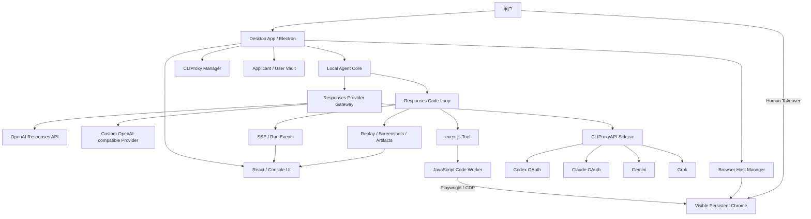

---

# 5. 官方 Sample 与产品版的差异

## 5.1 官方 Sample

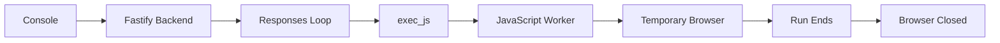

特点：

- 偏 Demo / Lab。
- Browser 生命周期跟 Run 绑定。
- 每个 Run 创建新的 Context。
- Run 结束 Browser/Worker 清理。

## 5.2 产品版

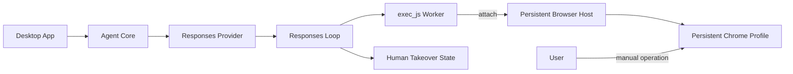

核心变化：

1. Browser 生命周期从“Run 生命周期”提升到“App / Profile 生命周期”。
2. Code Worker 与 Browser Host 解耦。
3. 增加 Provider Gateway。
4. 增加 CLIProxy Sidecar。
5. 增加 Human Takeover 状态机。
6. 增加长期用户资料与敏感信息 Vault。
7. 将 Lab Console 改造成真正的桌面 Agent UI。

---

# 6. 技术选型

## 6.1 Desktop

建议第一版：**Electron**。

原因：

- 上游 OpenAI Sample 已是 Node.js + TypeScript + React / Next.js。
- Playwright 原生 Node.js。
- 需要管理 Node Worker、浏览器进程、CLIProxyAPI Go Sidecar。
- Electron Main Process 很适合作为进程编排层。
- 能最大程度复用官方代码。

第一版不推荐 Tauri，主要原因不是能力不足，而是会增加：

```text
Rust Shell
  + Node Agent Runtime Sidecar
  + Playwright Runtime
  + CLIProxyAPI Go Sidecar
```

进程和打包复杂度明显更高。

---

## 6.2 Browser Runtime

- Playwright
- Chrome / Chromium
- Persistent userDataDir
- Headful 为默认
- CDP / Playwright attach

建议使用独立 Agent Browser Profile，而不是直接复用用户日常 Chrome Profile。

---

## 6.3 Agent Runtime

直接复用 OpenAI Sample：

- `responses-loop.ts`
- `exec_js`
- `javascript-worker.ts`
- Run event/replay contracts
- Runner Manager

---

# 7. 核心组件设计

## 7.1 Desktop Shell

职责：

- App 生命周期
- Window / Tray
- Sidecar 生命周期
- Browser Host 生命周期
- IPC
- Settings
- Secret Storage
- Auto Update

建议模块：

```text
desktop/main/
├── main.ts
├── app-lifecycle.ts
├── ipc/
├── windows/
├── sidecars/
├── browser/
└── security/
```

---

## 7.2 Responses Provider Gateway

当前 OpenAI Sample 基本写死：

```ts
new OpenAI({ apiKey })
```

产品版需要抽象：

```ts
export interface ResponsesProvider {
  id: string;
  name: string;

  create(
    request: ResponsesRequest,
    signal: AbortSignal
  ): Promise<ResponsesApiResponse>;

  listModels(): Promise<ModelInfo[]>;
  healthCheck(): Promise<ProviderHealth>;
  probeCapabilities(model: string): Promise<ModelCapabilities>;
}
```

Provider 实现：

```text
providers/
├── provider.ts
├── openai-provider.ts
├── cliproxy-provider.ts
└── custom-openai-provider.ts
```

OpenAI：

```text
baseURL = https://api.openai.com/v1
```

CLIProxyAPI：

```text
baseURL = http://127.0.0.1:8317/v1
```

Custom：

```text
baseURL = 用户设置
```

---

# 8. Responses Code Execution 流程

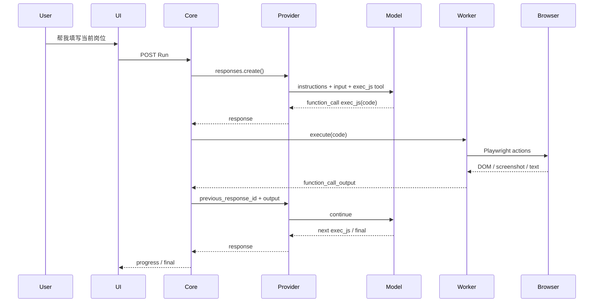

核心原则：

- Agent 尽量一次生成能完成多步操作的 JS。
- DOM / Locator 优先于坐标点击。
- 截图用于视觉确认和 DOM 无法解决时的 fallback。
- 一次 `exec_js` 可包含循环、条件、等待和批量操作。

---

# 9. Browser Host 架构

## 9.1 为什么 Browser Host 必须独立

如果 Worker 与 Browser 强耦合：

```text
Agent 代码死循环
  ↓
Worker 卡死
  ↓
Kill Worker
  ↓
Browser 也关闭
```

用户当前页面、验证码、表单进度都会丢失。

因此改成：

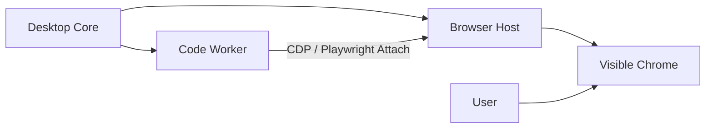

Worker 可以随时重启，但 Browser 保持不动。

---

## 9.2 Browser Profile

```text
profiles/
├── personal-job/
│   ├── chrome-user-data/
│   └── profile.json
├── work/
│   ├── chrome-user-data/
│   └── profile.json
└── test/
```

每个 Profile 独立保存：

- Cookie
- localStorage
- IndexedDB
- Login Sessions
- Site Permissions
- Browser Preferences

用户可在设置页选择：

```text
浏览器身份

● 个人求职
○ 工作账号
○ 测试账号

[新建身份]
```

---

# 10. Human Takeover 设计

## 10.1 状态机

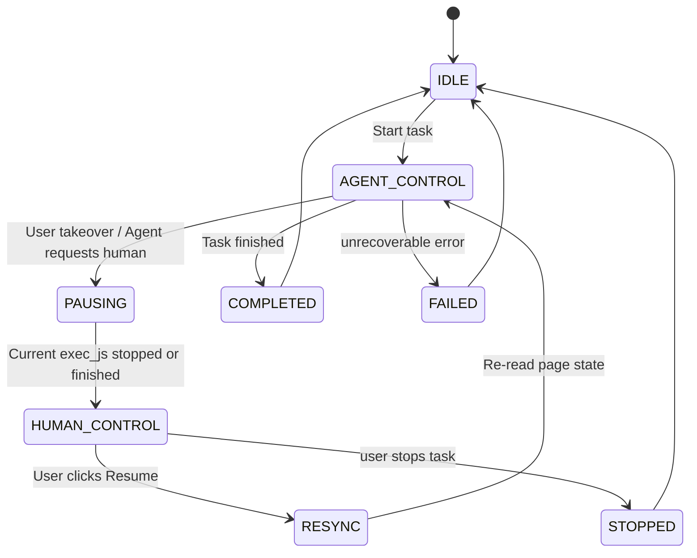

## 10.2 接管时浏览器不关闭

只暂停 Agent 自动化：

```text
Browser: Running
Worker: Idle / Paused
Agent Loop: Waiting for Human
```

用户可直接：

- 点击
- 输入
- 上传文件
- 登录
- 扫码
- 验证码
- 打开新 Tab
- 完成敏感确认

完成后点击：

```text
[让 Agent 继续]
```

Agent 进入 RESYNC：

1. 获取当前 tabs。
2. 获取当前 active page。
3. `page.url()`。
4. `page.title()`。
5. DOM / accessibility snapshot。
6. Screenshot。
7. 生成“用户已完成什么”的观察结果。
8. 继续 Responses Loop。

---

# 11. Agent 主动请求 Human Takeover

建议增加本地 tool：

```text
request_human_takeover
```

参数：

```json
{
  "reason": "sms_verification",
  "message": "请完成短信验证码后点击继续。",
  "resume_hint": "验证码输入完成后无需提交，Agent 会继续。"
}
```

典型原因：

- `captcha`
- `sms_verification`
- `qr_login`
- `final_submit_confirmation`
- `payment_confirmation`
- `privacy_consent`
- `ambiguous_user_choice`

---

# 12. CLIProxyAPI Sidecar 设计

## 12.1 架构

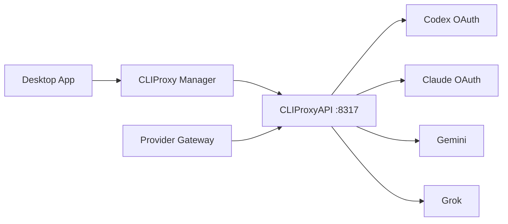

不建议把 CLIProxyAPI Go package 直接嵌进 Electron。

建议打包二进制：

```text
sidecars/cliproxy/
├── darwin-arm64/cliproxyapi
├── darwin-x64/cliproxyapi
├── win32-x64/cliproxyapi.exe
└── linux-x64/cliproxyapi
```

---

## 12.2 CLIProxy App 专属数据目录

不要污染用户全局 `~/.cli-proxy-api`。

macOS：

```text
~/Library/Application Support/<ProductName>/cliproxy/
├── config.yaml
├── auth/
├── logs/
└── state/
```

Windows：

```text
%APPDATA%/<ProductName>/cliproxy/
```

Linux：

```text
~/.config/<ProductName>/cliproxy/
```

---

## 12.3 推荐 CLIProxy 配置

```yaml
host: "127.0.0.1"
port: 8317

auth-dir: "/APP_DATA/cliproxy/auth"

api-keys:
  - "<generated-local-install-key>"

remote-management:
  allow-remote: false
  secret-key: "<generated-management-key>"

debug: false
logging-to-file: true
```

要求：

- 只监听 localhost。
- 本地随机 API key。
- Management API 不允许远程访问。
- Key 不进入前端 Renderer。
- Key 不进入 `exec_js` Worker。

---

# 13. CLIProxy OAuth 登录流程

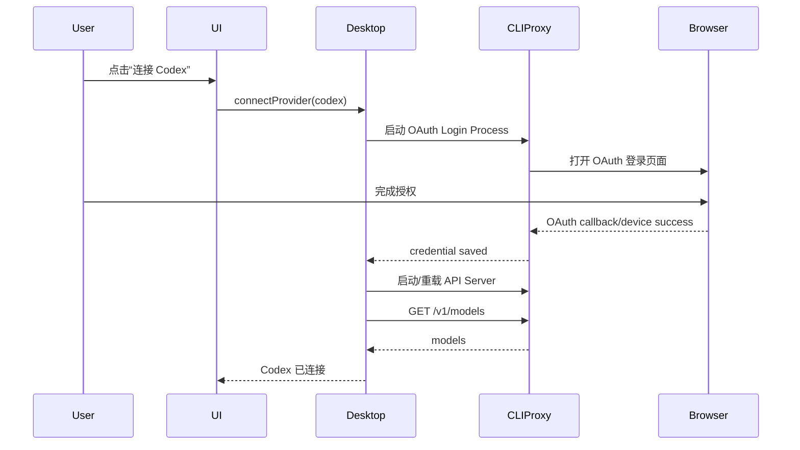

UI 不应要求普通用户手动执行：

```bash
cliproxyapi -codex-login
```

这些命令全部由 Desktop Manager 封装。

---

# 14. 设置页设计

```text
设置
├── 模型与 Agent
├── Local Agent
├── 浏览器
├── 自动化
├── 我的资料
├── 隐私与安全
└── 高级
```

## 14.1 模型与 Agent

```text
Agent Provider

● OpenAI
○ Local Agent (CLIProxyAPI)
○ Custom OpenAI-compatible

默认模型
[gpt-5.6-codex ▼]

Reasoning
[Medium ▼]

最大 Responses Turns
[30]
```

## 14.2 Local Agent

```text
CLIProxyAPI

状态            ● Running
监听地址        127.0.0.1:8317
自动启动        [✓]

[启动] [停止] [重启] [查看日志]

账户
────────────────
Codex      ● 已连接   [重新登录]
Claude     ○ 未连接   [连接]
Gemini     ○ 未连接   [连接]
Grok       ○ 未连接   [连接]
```

## 14.3 浏览器

```text
Agent Browser

默认模式：Visible
浏览器：Chromium / Chrome
Profile：个人求职

[打开浏览器]
[新建 Profile]
[管理登录状态]
```

---

# 15. Model Capability Probe

不能只靠 `/v1/models` 判断某模型是否适合 Browser Agent。

至少 Probe：

```text
Responses API                  ✓/✗
Function Tool Call             ✓/✗
Function Call Output           ✓/✗
previous_response_id           ✓/✗
Image Input                    ✓/✗
Reasoning                      ✓/✗
Structured Output              可选
```

流程：

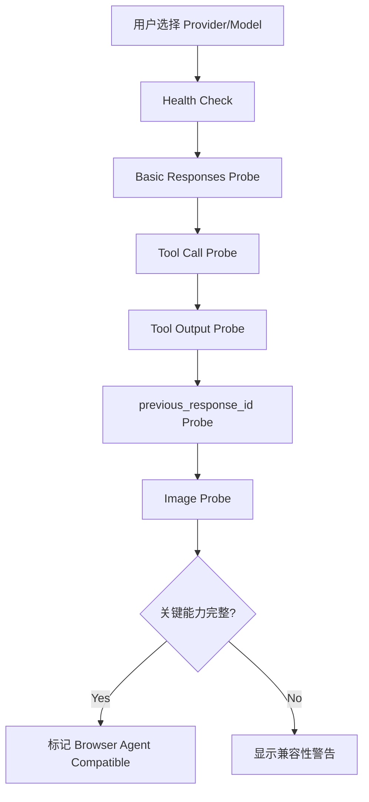

---

# 16. Applicant / User Vault

招聘投递场景建议增加用户资料 Vault。

```text
ApplicantVault
├── identity
│   ├── name
│   ├── phone
│   ├── email
│   └── city
├── education[]
├── experience[]
├── projects[]
├── preferences
├── resumes[]
└── sensitive
    ├── birthday
    ├── address
    └── identityNumber
```

## 16.1 敏感字段最小暴露

推荐增加本地 tool：

```text
fill_profile_field
```

模型只传：

```json
{
  "field": "phone",
  "locator": "#phone"
}
```

本地 Runtime：

```text
Vault -> 解密 phone -> Playwright fill
```

模型不需要看到手机号明文。

适合：

- 手机号
- 身份证号
- 家庭住址
- 出生日期
- 私密邮箱

---

# 17. 投递自动化等级

建议产品提供三个等级：

| 模式 | 行为 |
|---|---|
| 辅助模式 | Agent 只建议，用户手动执行 |
| 自动填写 | Agent 自动填写，提交前必须停 |
| 自动投递 | Agent 可自动提交符合规则的岗位 |

默认：

> **自动填写 + 最终提交确认**

最终提交示例：

```text
即将提交申请

公司：字节跳动
岗位：AI 应用开发工程师
地点：上海

✓ 基本资料
✓ 教育经历
✓ 工作经历
✓ 简历上传
✓ 附加问题

[查看网页] [确认提交] [取消]
```

---

# 18. 产品主要页面

## 18.1 首页 / Agent Chat

功能：

- 当前任务输入
- Provider / Model
- 浏览器状态
- Agent 状态
- 任务进度
- Run Events
- Takeover

按钮：

```text
[开始任务]
[暂停]
[我来操作]
[让 Agent 继续]
[停止]
[打开浏览器]
```

---

## 18.2 浏览器任务详情

展示：

- 当前 URL
- Page Title
- 当前 Tab
- Agent 最近执行代码
- 最近 Screenshot
- 最近操作结果
- 当前状态

---

## 18.3 历史任务 / Replay

直接复用官方 Replay 思路：

- Run Timeline
- Agent Message
- Function Call
- JavaScript Code
- Function Output
- Screenshot Timeline
- Error
- Final Result

---

# 19. Run 生命周期

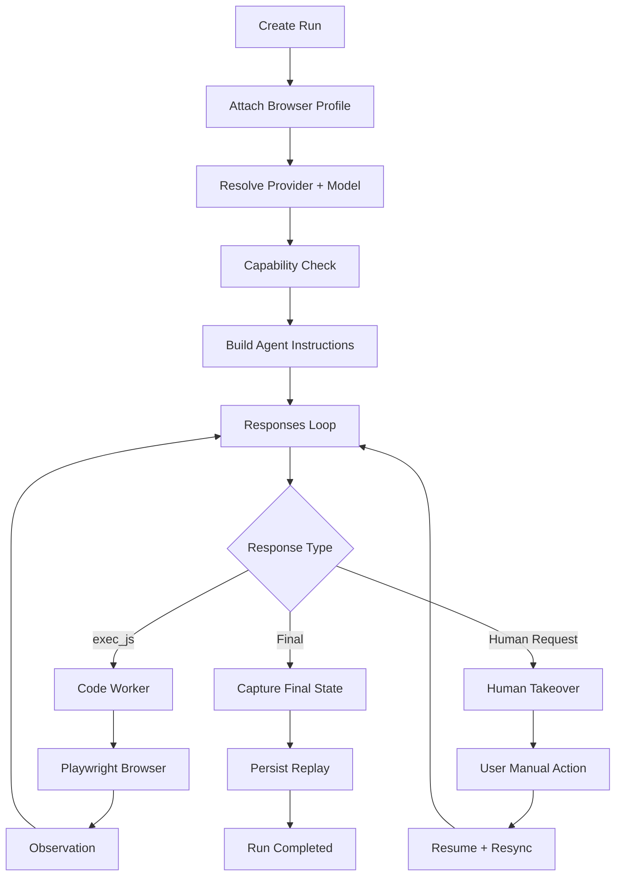

---

# 20. 文件目录设计

推荐 Monorepo：

```text
browser-agent-desktop/
│
├── apps/
│   ├── desktop/
│   │   ├── src/
│   │   │   ├── main/
│   │   │   │   ├── main.ts
│   │   │   │   ├── app-lifecycle.ts
│   │   │   │   ├── ipc/
│   │   │   │   ├── windows/
│   │   │   │   ├── tray/
│   │   │   │   └── updater/
│   │   │   ├── preload/
│   │   │   └── renderer/
│   │   └── package.json
│   │
│   └── console/
│       ├── app/
│       ├── components/
│       ├── hooks/
│       └── package.json
│
├── packages/
│   ├── contracts/
│   │   ├── run.ts
│   │   ├── events.ts
│   │   ├── replay.ts
│   │   ├── browser.ts
│   │   ├── provider.ts
│   │   └── settings.ts
│   │
│   ├── agent-core/
│   │   ├── responses-loop.ts
│   │   ├── runner-manager.ts
│   │   ├── run-context.ts
│   │   ├── instructions.ts
│   │   ├── tool-registry.ts
│   │   └── errors.ts
│   │
│   ├── providers/
│   │   ├── provider.ts
│   │   ├── openai-provider.ts
│   │   ├── cliproxy-provider.ts
│   │   ├── custom-openai-provider.ts
│   │   ├── capability-probe.ts
│   │   └── model-registry.ts
│   │
│   ├── browser-runtime/
│   │   ├── browser-host.ts
│   │   ├── browser-host-manager.ts
│   │   ├── browser-profile-manager.ts
│   │   ├── javascript-worker.ts
│   │   ├── javascript-process.ts
│   │   ├── protocol.ts
│   │   ├── takeover-manager.ts
│   │   ├── resync.ts
│   │   └── screenshots.ts
│   │
│   ├── cli-proxy/
│   │   ├── manager.ts
│   │   ├── process.ts
│   │   ├── config.ts
│   │   ├── oauth.ts
│   │   ├── health.ts
│   │   └── logs.ts
│   │
│   ├── applicant-vault/
│   │   ├── vault.ts
│   │   ├── schema.ts
│   │   ├── crypto.ts
│   │   └── tools.ts
│   │
│   ├── settings/
│   │   ├── settings-store.ts
│   │   ├── defaults.ts
│   │   └── migrations.ts
│   │
│   └── replay/
│       ├── writer.ts
│       ├── reader.ts
│       └── artifacts.ts
│
├── sidecars/
│   └── cliproxy/
│       ├── darwin-arm64/
│       ├── darwin-x64/
│       ├── win32-x64/
│       └── linux-x64/
│
├── resources/
│   ├── icons/
│   └── browser/
│
├── scripts/
│   ├── build-sidecars.mjs
│   ├── package-desktop.mjs
│   └── dev.mjs
│
├── tests/
│   ├── integration/
│   ├── e2e/
│   └── fixtures/
│
├── LICENSES/
│   ├── openai-cua-sample-app-LICENSE
│   └── CLIProxyAPI-LICENSE
│
├── package.json
├── pnpm-workspace.yaml
└── README.md
```

---

# 21. 本地数据目录

建议：

```text
<ProductData>/
├── settings/
│   └── settings.json
├── secrets/
│   └── system-keychain-references
├── browser/
│   └── profiles/
├── cliproxy/
│   ├── config.yaml
│   ├── auth/
│   └── logs/
├── runs/
│   └── <run-id>/
│       ├── replay.json
│       ├── events.jsonl
│       ├── screenshots/
│       └── artifacts/
├── vault/
│   └── encrypted.db
└── logs/
```

敏感信息：

- API Key → OS Keychain / Credential Manager
- CLIProxy local key → Keychain
- Vault master key → Keychain
- Browser Cookie → Chromium Profile

不要把 Secret 放在：

- Renderer localStorage
- Replay
- Run Events
- Screenshot metadata
- `exec_js` globals

---

# 22. Desktop IPC 设计

建议 Renderer 不能直接：

- spawn process
- read secrets
- read CLIProxy auth files
- read arbitrary filesystem

只通过 preload 暴露白名单：

```ts
window.agent = {
  startRun(),
  stopRun(),
  pauseRun(),
  resumeRun(),
  getActiveRun(),
  subscribeRunEvents(),
};

window.browserAgent = {
  openBrowser(),
  focusBrowser(),
  createProfile(),
  listProfiles(),
  requestHumanControl(),
  resumeAgentControl(),
};

window.providers = {
  listProviders(),
  listModels(),
  testConnection(),
  saveProvider(),
};

window.cliProxy = {
  status(),
  start(),
  stop(),
  restart(),
  connectCodex(),
  connectClaude(),
  readLogs(),
};
```

---

# 23. Tool Registry

第一版建议工具：

```text
exec_js
request_human_takeover
fill_profile_field
read_profile_summary
```

后续可以增加：

```text
select_local_file
save_download
read_clipboard
notify_user
```

`exec_js` 仍然是核心。

---

# 24. exec_js Worker 安全边界

OpenAI Sample 使用 `node:vm` 创建执行环境，但产品不能把它当真正安全沙箱。

Worker 只暴露：

```text
browser
context
page
Buffer
console.log
display
approved helper SDK
```

禁止暴露：

```text
require
process
process.env
fs
child_process
net
Electron IPC
OS Keychain
CLIProxy credentials
Vault raw secrets
```

另外建议：

- Worker 独立 OS Process。
- 每个 code call 有超时。
- 限制单次 code bytes。
- 限制 output bytes。
- Worker 崩溃不杀 Browser。
- 高危 helper 使用 allowlist。

---

# 25. Browser Agent Instructions 建议

System / Developer Instructions 至少应要求：

1. 优先使用 Playwright locator。
2. 不要依赖固定坐标。
3. 避免 `waitForTimeout`，优先等待真实页面状态。
4. 一次 `exec_js` 尽量完成一个完整局部任务。
5. 操作前检查页面是否符合预期。
6. 操作后验证结果。
7. 对提交、删除、支付等不可逆操作必须请求确认。
8. 遇 CAPTCHA / SMS / QR 登录时使用 Human Takeover。
9. 不读取与任务无关的本地敏感信息。
10. 不通过页面脚本绕过站点安全机制。

---

# 26. 错误与恢复

## 26.1 JS 执行错误

```text
exec_js throws
  ↓
return error as function_call_output
  ↓
model corrects code
```

## 26.2 Worker 卡死

```text
execution timeout
  ↓
kill Worker
  ↓
Browser stays alive
  ↓
restart Worker
  ↓
attach Browser
  ↓
resync page
```

## 26.3 Provider 失败

```text
429 / 500 / disconnect
  ↓
Provider retry policy
  ↓
optional fallback model
```

## 26.4 Browser Crash

```text
BrowserHost detects process exit
  ↓
Run enters RECOVERY_REQUIRED
  ↓
尝试重启同 Profile
  ↓
恢复 tabs/session if possible
```

---

# 27. 功能点清单

## 27.1 P0 核心

- [x] 桌面 App
- [x] Visible Agent Browser
- [x] Persistent Browser Profile
- [x] OpenAI Responses API
- [x] `exec_js`
- [x] Playwright Worker
- [x] 任务输入与运行结果（不是独立多轮聊天产品）
- [x] Start / Stop
- [x] Screenshot
- [x] Replay 数据落盘与截图/事件查看（完整播放器待实现）

## 27.2 P1 Human Takeover

- [x] Pause Agent
- [x] Human Control
- [x] Resume
- [x] Resync
- [x] Agent 主动请求 Takeover

## 27.3 P1 Provider

- [x] OpenAI Provider
- [x] CLIProxy Provider
- [x] Custom Provider
- [x] Model List
- [x] Capability Probe

## 27.4 P1 CLIProxy

- [x] Sidecar Process Manager
- [x] Start / Stop / Restart
- [x] App-owned config
- [x] Codex OAuth UI
- [x] Claude OAuth UI
- [x] Health Check
- [x] Logs

- [x] Antigravity OAuth UI 与 IPv4/IPv6 回调
- [x] 默认自动执行，无逐段代码审阅

## 27.5 P2 招聘投递

- [ ] Applicant Vault
- [ ] Resume Files
- [ ] Sensitive field local fill
- [ ] Submission confirmation
- [ ] Job history
- [ ] Automation levels

## 27.6 P3

- [ ] Companion Browser Extension
- [ ] Attach user existing Chrome tab
- [ ] PyAutoGUI desktop fallback
- [ ] Skill / Workflow Templates
- [ ] Multi-Agent

---

# 28. 招聘投递典型流程

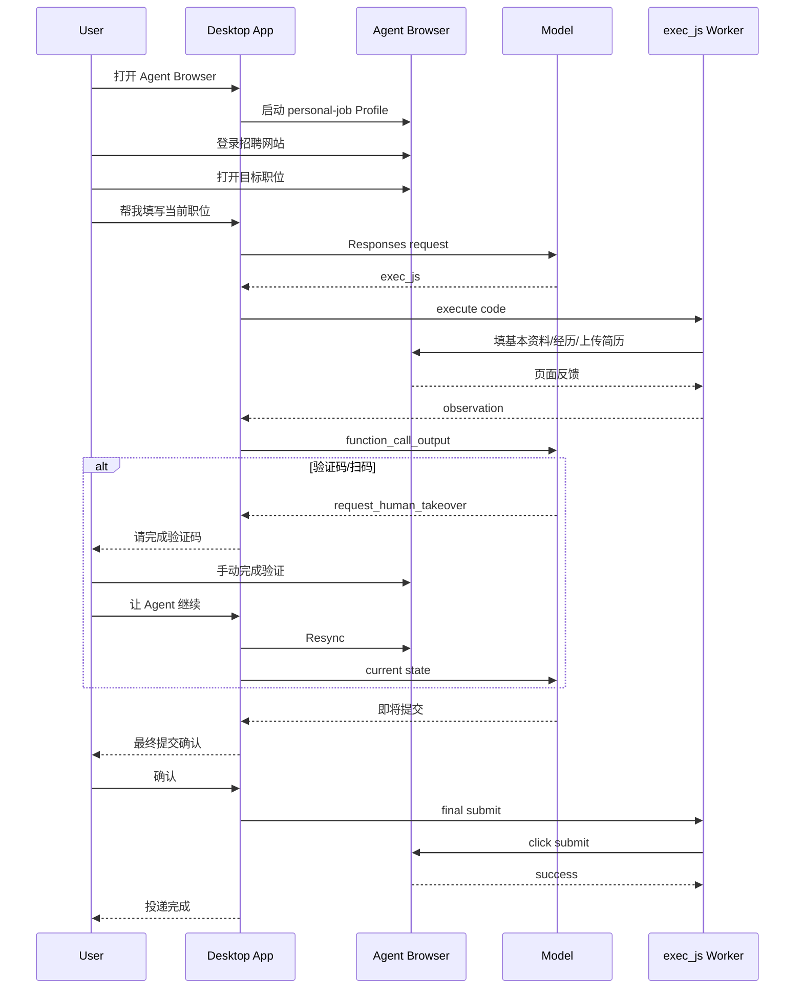

---

# 29. 开发迁移策略

## 阶段 0：Fork 官方项目

目标：

```text
openai-cua-sample-app
  ↓ fork
browser-agent-desktop
```

保留：

- console
- contracts
- JS responses loop
- JS worker
- runner manager
- screenshot/replay

删除/隔离：

- labs 作为产品依赖
- Python App 第一版不进入产品

---

## 阶段 1：先让官方 Sample 跑真实网页

改造：

- scenario 概念改成 free-form task。
- lab URL 改成真实 browser current tab。
- browser headful 默认开启。

---

## 阶段 2：BrowserHost + Persistent Profile

重点改造官方：

```text
javascript-process.ts
session.ts
```

把：

```text
Run -> launch browser
```

改成：

```text
App -> launch BrowserHost
Run -> attach BrowserHost
```

---

## 阶段 3：Human Takeover

新增：

```text
takeover-manager.ts
resync.ts
```

并扩展 Run 状态。

---

## 阶段 4：Provider Gateway

改造：

```text
responses-loop.ts
```

把 OpenAI Client 初始化抽离。

---

## 阶段 5：CLIProxy Sidecar

新增：

```text
packages/cli-proxy/
sidecars/cliproxy/
```

---

## 阶段 6：Electron 打包

把 Console / Agent Core / Browser / Sidecar 封装成真正桌面 App。

---

# 30. 建议最先修改的官方文件

## `javascript-app/src/responses-loop.ts`

改造点：

- 抽离 `OpenAIResponsesClient`。
- 接入 `ResponsesProvider`。
- Tool Registry 不再写死 `exec_js`。
- 支持 `request_human_takeover`。
- 支持 Run pause/resume。

## `javascript-app/src/javascript-worker.ts`

改造点：

- 保留 Playwright REPL。
- 增加受控 helper。
- 与 Browser Host 连接。
- 不负责 Browser 生命周期。

## `javascript-app/src/browser/session.ts`

改造点：

- 从 `newContext()` 改成 attach 已存在 Context/Profile。
- 支持 active page 切换。
- 支持多 Tab。

## `javascript-app/src/browser/javascript-process.ts`

这是最大改造点：

当前：

```text
launchServer -> fork worker -> worker connect -> close all
```

目标：

```text
BrowserHost separately owns browser
Worker independently connects
Worker restart does not close browser
```

## `runner-manager.ts`

扩展：

- Pause
- Human takeover
- Resume
- Recovery
- Browser session id
- Provider/model snapshot

## `contracts/`

新增：

- Provider
- Browser Profile
- Takeover State
- Capability Probe
- Settings

---

# 31. Review：架构优点

## 31.1 复用率高

最大的优点是没有重写最复杂的 CUA Agent Loop。

OpenAI 已经提供：

```text
Responses
→ function_call
→ exec_js
→ Worker
→ Playwright
→ observation
→ function_call_output
→ previous_response_id
```

本项目只是在其外面产品化。

## 31.2 Code Execution 很适合招聘投递

投递页面大量操作可以在一次调用里：

```js
for (const field of fields) {
  // locate
  // fill
  // verify
}
```

相比逐次 computer mouse action：

- round trip 更少
- token 更少
- 延迟更低
- DOM 操作更稳定

## 31.3 Human Takeover 与 Playwright 不冲突

只要 browser 是可见的，Playwright 和用户天然可以共用。

正确做法不是“把 Browser 控制权真正转交”，而是暂停 Agent 自动化逻辑。

## 31.4 CLIProxy Sidecar 解耦合理

CLIProxy：

- 独立升级
- 独立日志
- 独立认证
- 可选开启
- 不影响 OpenAI 官方 Provider

比直接 merge Go 源码维护成本低。

---

# 32. Review：当前方案需要特别警惕的问题

## 32.1 `node:vm` 不是安全 Sandbox

这是最重要的问题之一。

不能因为使用 `vm.createContext()` 就认为模型代码完全隔离。

产品正式发布前至少要做到：

- 独立 Worker Process。
- 最小 globals。
- 无 secrets env。
- 不开放 require。
- 不开放 fs / shell。
- worker 不拥有 Electron IPC。
- execution timeout。
- output size limit。

企业版若需要更高隔离，可考虑：

- OS sandbox
- container / microVM
- dedicated helper process

但第一版不建议因此把整个项目做重。

---

## 32.2 Persistent Browser 的安全责任更高

Profile 会持久保存登录状态。

必须：

- 明确告诉用户这是 Agent Browser。
- 不默认接管用户日常 Chrome Profile。
- Profile 独立目录。
- 用户可一键清除 Profile。
- 提供退出登录 / 清理数据入口。

---

## 32.3 Provider 兼容性不能假设

CLIProxyAPI 虽支持 Responses API，但不同下游 Provider 对：

- function calling
- previous_response_id
- image input
- reasoning
- Responses 特有字段

支持程度可能不同。

因此 Capability Probe 是必做，不是可选。

---

## 32.4 Browser 和 Worker 必须解耦

如果这一点不做，Human Takeover 体验会很脆弱。

建议在第一阶段架构改造时就完成，不要后补。

---

## 32.5 不要第一版支持“控制用户现有 Chrome”

第一版建议：

```text
Dedicated Agent Browser
```

而不是：

```text
Attach 用户正在用的 Chrome
```

原因：

- Profile 权限复杂
- Chrome Remote Debugging 限制
- Session 隔离差
- 隐私风险更高
- 产品行为难解释

以后可以通过 Companion Extension 提供“把当前 Tab 交给 Agent”。

---

## 32.6 最终提交必须有风险分级

Browser Agent 不应所有操作都同等自动化。

推荐：

```text
低风险
浏览 / 查询 / 填写
→ 可自动

中风险
发送消息 / 上传简历
→ 按用户设置

高风险
最终投递 / 删除 / 支付 / 修改账号
→ 默认人工确认
```

---

# 33. Review：建议的最终 MVP 边界

MVP 不要做成“万能电脑 Agent”。

只做：

```text
Desktop App
  +
Persistent Agent Browser
  +
Responses Code Execution
  +
Playwright
  +
Human Takeover
  +
OpenAI Provider
  +
CLIProxyAPI Local Agent
  +
Replay
```

第一个业务场景：

> **当前网页的招聘投递自动填写。**

第一版任务入口甚至只需：

```text
帮我填写当前页面
```

然后逐步扩展：

```text
批量投递
岗位筛选
自动打开岗位
跨网站投递
```

---

# 34. 最终推荐架构

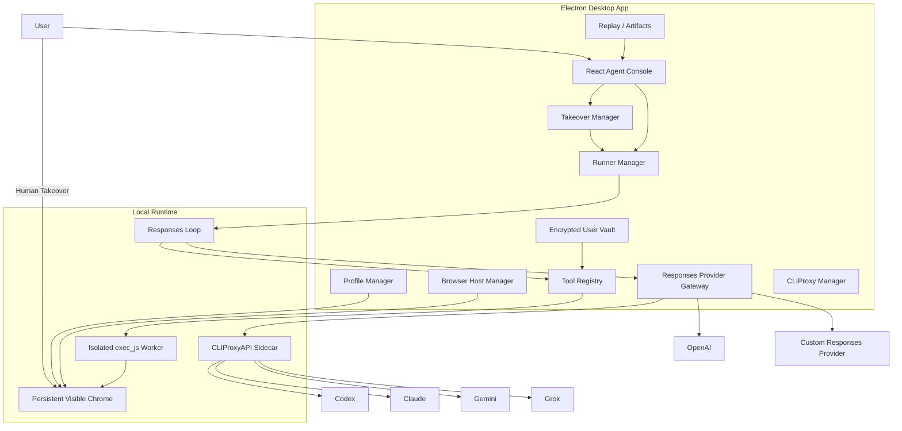

---

# 35. 最终 Review 结论

## 结论

该方案整体可行，且技术路线合理。

最推荐的组合为：

> **Electron Desktop App + OpenAI CUA Sample JavaScript Core + Playwright Persistent Agent Browser + Responses Code Execution + Human Takeover + CLIProxyAPI Sidecar。**

## 必须坚持的 5 个架构原则

1. **Fork OpenAI Sample，而不是重写 Responses Loop。**
2. **Browser Host 与 Code Worker 解耦。**
3. **Persistent Profile 属于 Agent Browser，不直接复用用户主 Chrome。**
4. **Responses Provider 必须抽象，CLIProxyAPI 只是其中一个 Provider。**
5. **Human Takeover 是 Agent Pause + Browser Keep Alive，不是关闭/重开浏览器。**

## 第一版最重要的验证

第一版只要完整验证下面一条链路，就说明架构成立：

```text
打开 Desktop App
↓
打开 Agent Browser
↓
用户登录招聘网站
↓
用户打开一个岗位
↓
输入“帮我填写当前页面”
↓
Responses API 生成 exec_js
↓
Playwright 自动填写
↓
遇验证码，请求 Human Takeover
↓
用户完成验证码
↓
Resume
↓
Agent 继续
↓
提交前人工确认
↓
提交
↓
Replay 可查看全过程
```

如果这条链路稳定，再继续增加批量投递、自动找岗位、现有 Chrome Extension 接管等能力。

---

# 36. License 注意事项

两个上游项目均为 MIT License，可用于修改、分发和商业产品，但需要遵守对应 License 要求并保留版权/许可声明。

建议项目中保留：

```text
LICENSES/
├── openai-cua-sample-app-LICENSE
└── CLIProxyAPI-LICENSE
```

并在 About / Third-party Licenses 中展示第三方开源声明。

---

# 37. 下一步实施建议

以下为原始迁移顺序，核心迁移已经完成；当前下一步以第 0.6 节为准。

优先顺序：

```text
1. fork openai-cua-sample-app
2. 只保留 JavaScript / Playwright 路线
3. 去 Lab 化，改为 Free-form Browser Task
4. 拆 BrowserHost
5. Persistent Profile
6. Worker attach BrowserHost
7. Human Takeover
8. Provider Gateway
9. CLIProxy Sidecar
10. Electron Shell
11. 招聘 Applicant Vault
12. Submission Confirmation
```

这条顺序可以最大程度减少重构返工。

# 38. Chrome 当前标签页扩展（实现增量）

已增加 `extensions/chrome` Manifest V3 扩展和本机 `packages/core/src/browser/extension-relay.ts`。用户在桌面生成单次连接码，在已登录的 Chrome 网站标签页点击扩展主动接入；Worker 仍通过 Playwright `connectOverCDP` 使用原有执行循环。具体安装步骤见 README「连接日常 Chrome 当前标签页」。

桌面工作台可选择独立 Profile 或扩展来源，运行中不能切换来源。配对只监听随机 loopback 端口，验证 Host、扩展 Origin 和短期随机令牌；Worker 使用不同的 CDP 令牌。断开会撤销连接、拒绝等待中的命令并 detach，不关闭用户标签页或 Chrome。

首版限定单一选定 tab，保留 DOM 定位、页面内操作、截图和页面已有登录状态；不支持创建/关闭其他 tab 或浏览器全局操作。普通 HTTP/HTTPS 页面可连接，Chrome 内部页不支持。参考并改造 Playwright 1.63 的 BrowserModel/CDPRelay 会话映射方式，Apache-2.0 许可与 NOTICE 已随包保留。

新增自动化验收使用真实 Chromium 加载真实扩展：页面已有 localStorage 状态 → 扩展选定 tab → 独立 Worker 填表/截图 → 重连 → 断开；另一个 tab 不被暴露给 Playwright，断开后不能继续修改表单。尚未验证用户个人 Chrome 的全部扩展、企业策略或跨域 iframe 组合，不声称全面兼容。
